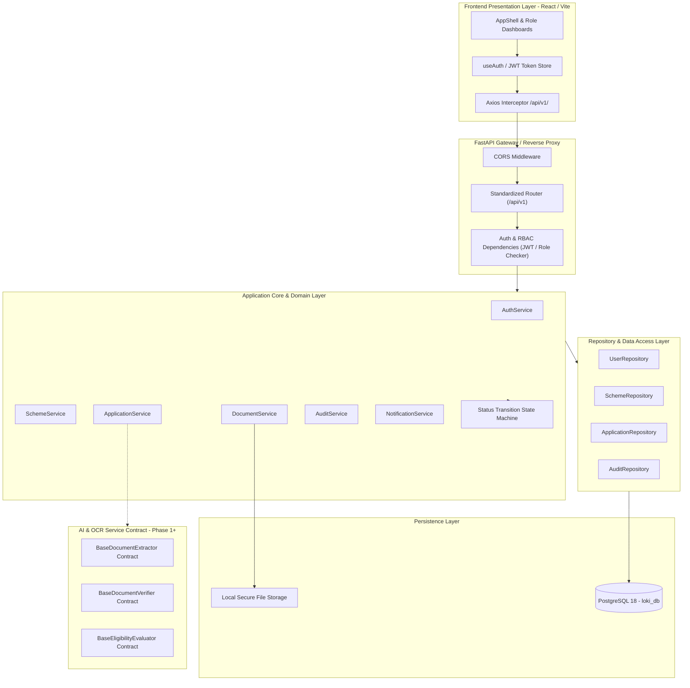

# System Architecture: AI-Enabled Scholarship & Fellowship Management System
**Ministry of Tribal Affairs (MoTA) | Smart India Hackathon (SIH)**

---

## 1. Overview & Architectural Principles

This document specifies the **production-oriented foundation** architecture for Phase 0 of the AI-Enabled Scholarship and Fellowship Management System. The architecture is engineered to ensure scalability, data integrity, rigorous auditability, and clean decoupling between transactional workflows and automated AI/OCR verification pipelines.

### Core Architectural Pillars
- **Strict PostgreSQL 18 Persistence**: No SQLite fallback is permitted. High-concurrency relational data, transactional consistency, and JSONB document structures are exclusively persisted in PostgreSQL 18.
- **Clean Layered Separation**:
  - `Presentation Layer`: React 18, TypeScript, Tailwind CSS, Vite App Shell.
  - `API Layer`: FastAPI with standardized `/api/v1/` RESTful routing, Pydantic v2 schemas, and dependency-injected OAuth2 JWT security.
  - `Domain & Service Layer`: Strict business logic isolation, state machine transition validation, and decoupled service abstractions.
  - `Repository Layer`: Encapsulated database operations built on SQLAlchemy 2.0.
  - `Data Layer`: PostgreSQL 18 managed by Alembic database migrations.
  - `AI / OCR Subsystem Interface`: Formal abstract contracts ready for Phase 1 integration without mock or fake logic.
- **Traceable Entity-Level Auditing**: Every critical mutation across users, applications, documents, and schemes records an immutable entry with `entity_type` and `entity_id`.
- **Scheme Versioning Architectural Foundation**: In Phase 0, `scheme_version` (defaulting to `"1.0"`) is embedded into scheme definitions and schemas. **Important clarification:** In Phase 0, this establishes the necessary schema and repository foundation for future historical scheme version management; full historical version branching and diffing will be completed in subsequent phases.
- **Disclaimers for Demo Configurations**: Schemes such as NFST and NOS are marked with `is_demo=True` and clear disclaimers, indicating that official gazetted rules are pending administrative verification.

---

## 2. High-Level Architecture Diagram



---

## 3. Role-Based Access Control (RBAC) Matrix

The system implements 4 primary user roles:

| Role | Description | Accessible Routes / Actions |
| :--- | :--- | :--- |
| **`APPLICANT`** | Tribal student/researcher applying for fellowships or scholarships | Can register, login, view active schemes, create drafts, submit applications, upload documents, and view own application status & audit logs. Restricted from admin/officer queues. |
| **`OFFICER`** | Desk / Verification officer in MoTA or state nodal agency | Can view all submitted applications, inspect documents, update verification status, flag deficiencies, and review audit trails. |
| **`COMMITTEE`** | High-level selection / screening committee member | Can review verified candidates, inspect merit scores, and evaluate shortlist recommendations. |
| **`ADMIN`** | System administrator | Full administrative privileges, user management (`/api/v1/users`), scheme creation & modification (`/api/v1/schemes`), and global audit inspection. |

---

## 4. API Standardization Strategy

All RESTful endpoints are strictly standardized under the prefix:
```
/api/v1/{resource}
```
Examples:
- `/api/v1/health` & `/api/health`
- `/api/v1/auth/register`, `/api/v1/auth/login`, `/api/v1/auth/me`
- `/api/v1/schemes/`
- `/api/v1/applications/`
- `/api/v1/documents/`
- `/api/v1/users/`
- `/api/v1/audit/`

---

## 5. Storage & Security Architecture

1. **Storage Architecture**:
   - Files are stored in a dedicated directory hierarchy: `{STORAGE_PATH}/applications/{application_id}/{uuid}_{original_name}`.
   - Storage service is abstracted via `BaseStorageService`, allowing Phase 0 local filesystem storage to swap transparently to S3 / MinIO in production.
2. **Security**:
   - Passwords hashed using `bcrypt` (work factor 12).
   - Stateless JWT tokens encoded with HMAC-SHA256 containing expiration and role claims.
   - Cross-Origin Resource Sharing (CORS) restricted to authorized origins.
