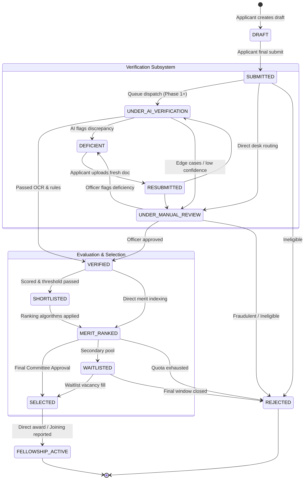

# Lifecycle Workflows & State Machines
**Ministry of Tribal Affairs | AI-Enabled Scholarship & Fellowship Management System**

---

## 1. Application Lifecycle State Machine

The system enforces strict state transition guards. Illegal state jumps are rejected by `status_transitions.py`.

---

## 2. Document Deficiency Resolution Workflow

When a certificate (e.g. Income Certificate expired or ST Certificate mismatch) is flagged:

1. **Detection**:
   - Automated AI/OCR check or Officer manual inspection identifies missing or inconsistent information.
   - Status updated to `FLAGGED` or `RESUBMISSION_REQUIRED`.
2. **Deficiency Notice Generation**:
   - Record created in `deficiencies` table with actionable guidance for the tribal applicant.
   - Application status moved to `DEFICIENT`.
   - In-app notification and SMS/Email notification triggered to applicant.
3. **Applicant Resubmission**:
   - Applicant logs into portal, reviews deficiency note, and uploads updated document.
   - Application status transitions to `RESUBMITTED`.
4. **Re-Verification & Audit**:
   - Re-entered into verification queue.
   - Full event lineage recorded in `audit_logs`.

---

## 3. Post-Selection Fellowship Management Workflow

For candidates transitioning to `FELLOWSHIP_ACTIVE` (e.g. NFST Fellows):

1. **Award Letter Issuance**: Formal digital letter generated with unique award number.
2. **Joining Verification**: University guide / registrar verifies joining date.
3. **Disbursement Tracking**: Integration with DBT (Direct Benefit Transfer) / PFMS.
4. **Annual Renewal Cycle**:
   - Scholar submits `RenewalSubmission` with annual university progress report.
   - Desk officer approves continuation for Year 2, 3, 4, 5.
   - `ProgressReport` archived for compliance.
